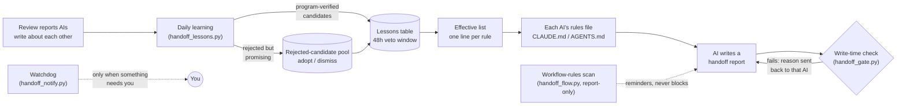

# self-improving-handoffs

**Make multi-AI handoffs get better on their own.** A write-time checker for handoff reports, plus a shared "lessons book" that learns from the mistakes AI reviewers catch in each other and rolls them out as one-line rules — with a 48-hour human veto window — plus a report-only scanner for workflow rules (when to write a report vs. edit one).

[](https://github.com/Wyk915501/self-improving-handoffs/actions/workflows/tests.yml)


> 📖 **中文完整说明 → [README.zh-CN.md](README.zh-CN.md)**
>
> ⚠️ **This project is Chinese-first.** File-name conventions (`*_交接报告.md` under a `工作传递/` folder), all script messages, and the detailed docs are in Chinese. The code itself is plain Python with no language-specific dependencies.

---

## The problem

When several AI tools (Claude Code, Codex, ZCode, …) hand work to each other through a shared docs tree:

- **Rules written in docs don't get read** at the moment someone is writing a report.
- **The same format mistakes keep coming back** — broken headers, wrong timestamps, dead links.
- **Every new rule needs a human to approve it**, so the improvement loop never actually turns.
- **Nobody can tell whether conclusions flowed back** into the canonical docs, or whether a task got splintered into a dozen tiny reports.

## How it works



1. **Write-time check** (no LLM). Every time an AI writes a handoff report, a hook runs `handoff_gate.py` and checks the file name, front-matter validity, status words, required keys, real timestamps, temp-dir references, links (including backslash links that break on the other machine), and edits to already-frozen reports; index READMEs get their own link check. The reason goes back to *that* AI so it fixes its own report. A periodic scan covers writers that have no hooks.
2. **Daily learning** (one model call per day). Review reports written by *other* AIs are fed to a model that may only return JSON candidates — it has no file access. **The program then verifies each candidate**: every quote must appear verbatim in the source, evidence must come from ≥2 independent original events, the category must be whitelisted, and it must not duplicate or contradict existing or vetoed rules. Survivors are added as "proposed" and take effect after 48 hours unless you veto them. **Rejected-but-promising candidates are not thrown away**: they go into a rejected-candidate pool, and the decision page shows each one with **Adopt** / **Dismiss** buttons — adopting writes it in as a human-approved rule.
3. **Distribution.** Only the currently effective rules (normally ≤15, one line each) are written to a short file that each AI's rules file imports at the start of a session.
4. **Workflow-rules scan** (no LLM, report-only, new in v5). Machine checks for process rules that live in your own `工作传递/README.md`: W1 canonical docs edited but no report left behind, W2 a report declares a backflow target that never got updated (or is a broken path), W3 a source directory producing a burst of small reports instead of updating one draft. Findings go to a reminder list — it never blocks anyone.

## What you actually do

Three things, and none is required:

- **Reject a rule you don't like** — one click on the decision page (or add a line to the veto file). Doing nothing means you agree.
- **Adopt a rejected candidate you do like** — one click; it enters the table as a human rule with the same 48h veto window.
- **Nudge an AI that keeps failing** — the watchdog tells you which one.

Everything else runs unattended.

## Quick start

Requirements: Python 3.10+ and `pip install pyyaml` (without it the checker fails closed). The daily-learning step additionally needs either a logged-in `claude` CLI or a `GLM_API_KEY`.

```bash
git clone https://github.com/Wyk915501/self-improving-handoffs
cd self-improving-handoffs
pip install pyyaml
python -X utf8 规范/交接写时门/tests/test_gate.py      # 53 checks
python -X utf8 规范/交接写时门/tests/test_lessons.py   # 43 checks, fake model, no network
python -X utf8 规范/交接写时门/tests/test_notify.py    # 55 checks, no popups, no registry
python -X utf8 规范/交接写时门/tests/test_flow.py      # 8 checks, report-only scanner
```

Then follow **[README.zh-CN.md → 十分钟装起来](README.zh-CN.md)**: put the scripts into your docs tree, copy the hook snippet from [`部署样例/`](部署样例/) for your platform, and write one deliberately broken report to confirm the AI gets the failure reason back.

## Which model, and who pays

Only the daily-learning step calls a model, at most once a day. The checker, scanner, watchdog, and scan call **no model at all**.

| `--provider` | What it calls | Whose quota |
|---|---|---|
| `claude` | the local `claude` CLI (default model `sonnet`) | the account `--config-dir` points to; measured ≈ US$0.65 per run |
| `glm` | Zhipu GLM API over HTTPS, standard library only (default `glm-5.3`) | the `GLM_API_KEY` account |

Both providers go through the same program-side verification, so switching models never lowers the bar — at worst fewer candidates get accepted. Each call's model, endpoint, and token usage are written to the daily-learning log.

## Validation, honestly

- **159 regression tests** that call the production code, run on Windows and Linux.
- Ran for about two weeks on one Windows 11 machine (publisher) and one Linux server (checks only).
- Claude Code hooks were verified to fire on both machines. **The ZCode hook was installed but never verified to fire.**
- Real daily-learning runs: 26 reports → 0 rules accepted (claude); 23 reports → 1 rule accepted (glm, in effect since); on several later days 1–3 candidates were nominated and all rejected by the program's own checks — which is why v5 added the rejected-candidate pool with one-click adopt.
- The workflow-rules scanner, on its first real run over ~940 existing reports, surfaced 20+ genuine process findings (report fragmentation, broken backflow paths).
- Reviewed across several adversarial rounds by other AI reviewers. What each round caught is listed in [`设计要点与审查史.md`](设计要点与审查史.md).

This is a working, tested prototype with its limits written down — not a finished product.

## Limits

- It is a **post-write hint, not a gate**: it can't stop a write, and it checks format, not whether the content is right.
- A new rule is free text; the program cannot prove it's only about report-writing. A review report can also cite a real report ID and invent a story around it — the verifier checks that sources *exist*, not that they're *relevant*. The 48-hour veto window is the backstop.
- The workflow scanner is report-only and young (v0.1): its heuristics (mtime windows, update-record dates) produce reminders, not verdicts; expect false positives and tune before enforcing.
- Notifications are Windows-only and only visible at the logged-in desktop. There is no off-machine alerting, and if the watchdog itself stops, nothing tells you.
- Scheduled tasks **must use `pythonw.exe`**. With `python.exe` a console window flashes on every run, and closing it kills the running job (we hit this: exit code `0xC000013A`, no log written).
- Only one machine may publish (run the daily learning); others just read the effective list.

## Layout

```
规范/交接写时门/     the scripts, their detailed docs, and the four test suites
                    (gate v2.5, lessons v3.6, notify v1.7, flow v0.1)
工作传递/            sample docs tree: report template, a synthetic lessons table,
                     and files the scripts generated from it
部署样例/            hook snippets (Claude Code, ZCode, Linux), rules-file snippets,
                     Windows scheduled-task script, cron example
设计要点与审查史.md   why it is built this way and what each review round caught
```

Script names and paths are the ones used in the original deployment. Code-level names such as `US3` (the Linux server) and `Codex` / `GLM` (other AI reviewers) are explained in the Chinese README.

## License

[MIT](LICENSE)
