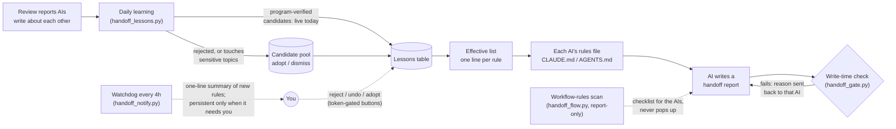

# self-improving-handoffs

**Make multi-AI handoffs get better on their own.** A write-time checker for handoff reports, plus a shared "lessons book" that learns from the mistakes AI reviewers catch in each other and rolls them out as one-line rules — **live the same day**, with a one-line notification per new rule and a one-click "reject" (and "undo") for the human in charge. A report-only scanner covers workflow rules, and a single command-line entry point installs, checks and deploys the whole thing.

[](https://github.com/Wyk915501/self-improving-handoffs/actions/workflows/tests.yml)


> 📖 **中文完整说明 → [README.zh-CN.md](README.zh-CN.md)**
>
> ⚠️ **This project is Chinese-first.** File-name conventions (`*_交接报告.md` under a `工作传递/` folder), all script messages, notifications and the detailed docs are in Chinese. The code itself is plain Python with no language-specific dependencies.

---

## The problem

When several AI tools (Claude Code, Codex, ZCode, …) hand work to each other through a shared docs tree:

- **Rules written in docs don't get read** at the moment someone is writing a report.
- **The same format mistakes keep coming back** — broken headers, wrong timestamps, dead links.
- **Every new rule needs a human to approve it**, so the improvement loop never actually turns.
- **Nobody can tell whether conclusions flowed back** into the canonical docs, or whether a task got splintered into a dozen tiny reports.

## How it works


```mermaid
flowchart LR
    A["AI writes a<br/>handoff report"] --> B{"Write-time check<br/>(handoff_gate.py)"}
    B -- "fails: reason sent<br/>back to that AI" --> A
    C["Review reports AIs<br/>write about each other"] --> D["Daily learning<br/>(handoff_lessons.py)"]
    D -- "program-verified<br/>candidates: live today" --> E[("Lessons table")]
    D -- "rejected, or touches<br/>sensitive topics" --> P[("Candidate pool<br/>adopt / dismiss")]
    E --> F["Effective list<br/>one line per rule"]
    P --> E
    F --> G["Each AI's rules file<br/>CLAUDE.md / AGENTS.md"]
    G --> A
    H["Watchdog every 4h<br/>(handoff_notify.py)"] -. "one-line summary of new rules;<br/>persistent only when it needs you" .-> I(("You"))
    I -. "reject / undo / adopt<br/>(token-gated buttons)" .-> E
    J["Workflow-rules scan<br/>(handoff_flow.py, report-only)"] -. "checklist for the AIs,<br/>never pops up" .-> A
```

1. **Write-time check** (no LLM). Every time an AI writes a handoff report, a hook runs `handoff_gate.py` and checks file name, front-matter validity, status words, required keys, real timestamps, temp-dir references, links (including backslash and machine-local absolute links that break on the other machine), and edits to already-frozen reports; index READMEs get their own link check. The reason goes back to *that* AI so it fixes its own report. A scan every 4 hours covers writers that have no hooks.
2. **Daily learning** (one model call per day, split into ≤3 batches when there is a backlog). Review reports written by *other* AIs are fed to a model that may only return JSON candidates — it has no file access. **The program then verifies each candidate**: every quote must appear verbatim in the source, evidence must come from ≥2 independent original events, the category must be whitelisted, and it must not duplicate existing or rejected rules. **Survivors go live the same day.** Candidates that fail only softer checks (thin evidence but at least one verified quote, a quota already used up, slightly too long) go through a pool and are added automatically in the same run, or the next one once the daily cap frees up; candidates that touch sensitive topics (permissions, deployment, deletion, secrets) or carry commands, URLs, local paths, invisible characters or zero verified quotes are **held** until the human clicks *Adopt*.
3. **Distribution.** Only the currently effective rules (one line each, capped at 40) are written to a short file that each AI's rules file imports at the start of a session. A per-machine ledger recognises rows that were written into the table directly (not by this pipeline); if such a row looks sensitive it is withheld until confirmed.
4. **Watchdog** (no LLM, every 4 hours, Windows). Native toast notifications, grouped by kind: a quiet one-line summary of new rules (at most three per toast, each rule told exactly once); a persistent "needs you" toast only for real failures, always with the fix in its second line; everything else is a quiet notice that expires after a day. Notification text never contains internal IDs — a test fails if the last-line scrubber ever has to step in. A local decision page lists everything with token-gated buttons (*Reject*, *Undo*, *Restore*, *Adopt*); it refreshes itself after a click, carries exactly one fixed script whitelisted by CSP hash, and escapes all rule text.
5. **Workflow-rules scan** (no LLM, report-only). Machine checks for process rules that live in your own `工作传递/README.md`: W2 a report declares a backflow target that never got updated, W3 a source directory producing a burst of small reports instead of updating one draft (both on by default); W1 canonical docs edited but no report left behind is off by default (`--w1`) and only looks at the original project's `docs/项目情况/` folder. Findings go to a checklist the AIs read when they start work — they never pop up for the human.

## What you actually do

Nothing, most days. When you want to:

- **Reject a rule you don't like** — click the toast, then *Reject* on the decision page; it is removed from the effective list immediately. Misclicked? *Undo* at the top of the page.
- **Adopt a held candidate you do like** — one click.
- **Act on a "needs you" toast** — its second line says what to do (usually: paste one sentence into any AI window to run the health check).

## Quick start

Requirements: Python 3.10+ and `pip install pyyaml` (without it the checker fails closed). The daily-learning step additionally needs a model — see below.

```bash
git clone https://github.com/Wyk915501/self-improving-handoffs
cd self-improving-handoffs
pip install pyyaml
python -X utf8 规范/交接写时门/handoffctl.py test        # all six suites; prints the SHA of every file under test
python -X utf8 规范/交接写时门/handoffctl.py install --dry-run   # see what it would do
```

On **Windows**, `install` (without `--dry-run`) creates a runtime directory `~/.claude/handoff/`, deploys a tested copy of the scripts (pinned by a SHA-256 manifest), writes a minimal config, installs project-level write-time hooks for Claude Code and ZCode, creates two scheduled tasks (daily learning at 01:00 UTC, watchdog every 4 hours, both via `pythonw`), registers the decision-page URL protocol, installs the operations skill, and runs `doctor`. On **Linux**, it installs the hooks and the skill and prints a suggested cron line for the periodic scan — daily learning and notifications live on a single Windows publisher.

Then follow **[README.zh-CN.md → 十分钟装起来](README.zh-CN.md)** to trim the report template to the keys you actually want, and write one deliberately broken report to confirm the AI gets the failure reason back.

Day to day: `handoffctl.py status` (one screen), `handoffctl.py doctor` (read-only health check). After editing a script: `test` → `promote` → `doctor` — scheduled tasks, hooks and buttons only ever run the promoted copy.

## Which model, and who pays

Only the daily-learning step calls a model, once a day. The checker, scanner and watchdog call **no model at all**.

| `lessons.provider` | What it calls | Whose quota |
|---|---|---|
| `glm` (default) | Zhipu `glm-5.3` **through Claude Code** (`claude -p --bare --model glm-5.3`, pointed at Zhipu's Anthropic-compatible endpoint) | your GLM Coding Plan subscription |
| `claude` | your logged-in Claude Code (default model `sonnet`) | that Claude account |

Why through Claude Code: Zhipu's terms say the GLM Coding Plan may only be used inside the coding tools they support, and calling the coding endpoint from your own scripts is not allowed — so the scripts refuse any `/api/coding/` endpoint. Calling the API directly (`lessons.glm_via: "api"`) is only allowed against the standard pay-as-you-go endpoint. Both providers go through the same program-side verification, so switching models never lowers the bar. Each call's model and token usage go to the daily-learning log; malformed model output is saved for diagnosis and retried with a smaller batch.

## Validation, honestly

- **530 regression tests** in six suites, all calling the production code, run on Windows (Python 3.14 and 3.12); CI runs them on Linux and Windows with Python 3.10 and 3.12. The toast XML is round-tripped through Windows' own XML parser in a dry run; that part is skipped (reported as SKIP, not PASS) where Windows notification components are unavailable.
- In daily use since 2026-09-08 on one Windows 11 machine (publisher) and one Linux server (checks only). The original owner adopted 20+ candidates through the decision page; 30+ rules are in effect.
- Claude Code hooks were verified to fire on both machines. **The ZCode hook was installed but never verified to fire.**
- v7 is the result of a full audit (50 findings, two independent re-review rounds) plus an adversarial multi-agent review of the new notification and page code. **The v7 toasts and decision page have not yet been clicked through on a real desktop**, and the Claude-Code-based GLM transport has had one real dry run (real model call, no writes) before release.
- What each review round caught is listed in [`设计要点与审查史.md`](设计要点与审查史.md).

This is a working, tested prototype with its limits written down — not a finished product.

## Limits

- It is a **post-write hint, not a gate**: it can't stop a write, and it checks format, not whether the content is right.
- A new rule is free text; the program cannot prove it's only about report-writing, and a review report can cite real report IDs around an invented story — the verifier checks that sources *exist*, not that they're *relevant*. The backstops are verbatim quotes, independent events, hard blocks on sensitive shapes, a one-line summary of every new rule, and one-click removal. If the human ignores the notifications for days, a bad rule stays live for days.
- The buttons' tokens stop web pages, misclicks and stale scripts — not a program that can read the local state file (such a program could edit the table directly anyway).
- Notifications are Windows-only and only visible at the logged-in desktop; there is no off-machine alerting. If the watchdog stops, the daily run notices within a day; if the machine is off, nothing does.
- Scheduled tasks **must use `pythonw.exe`** (`install` does this). With `python.exe` a console window flashes on every run, and closing it kills the running job (we hit this: exit code `0xC000013A`, no log written).
- Only one machine may publish (run the daily learning); others just read the effective list.
- Rule revision/merging is not automated: at the cap (40), new rules pause and the human approves a merge plan drafted by an AI.

## Layout

```
规范/交接写时门/     the scripts, their detailed docs, the operations skill, and the six test suites
                    (gate v2.8, lessons v3.9, notify v1.13, flow v0.3, handoffctl, handoff_common)
工作传递/            sample docs tree: report template, a synthetic lessons table,
                     and files the scripts generated from it
部署样例/            hook snippets (Claude Code, ZCode, Linux), rules-file snippets, cron example
设计要点与审查史.md   why it is built this way and what each review round caught
```

Script names and paths are the ones used in the original deployment. Code-level names such as `US3` (the Linux server) and `Codex` / `GLM` (other AI reviewers) are explained in the Chinese README.

## License

[MIT](LICENSE)
